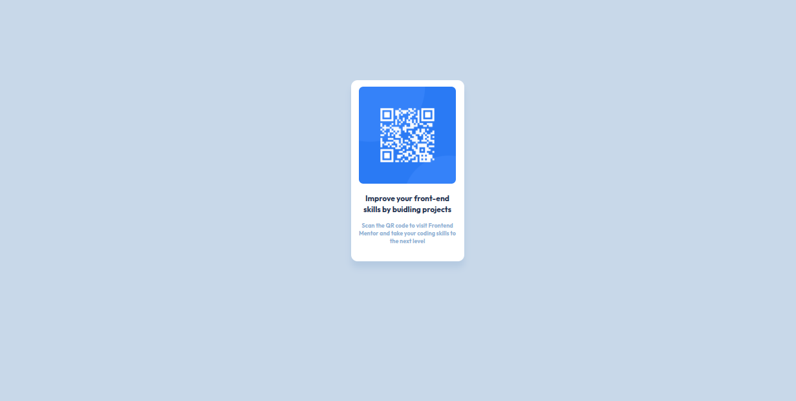

# Frontend Mentor - QR code component solution

This is a solution to the [QR code component challenge on Frontend Mentor](https://www.frontendmentor.io/challenges/qr-code-component-iux_sIO_H). Frontend Mentor challenges help you improve your coding skills by building realistic projects. 

## Table of contents

- [Overview](#overview)
  - [Screenshot](#screenshot)
  - [Links](#links)
- [My process](#my-process)
  - [Built with](#built-with)
  - [What I learned](#what-i-learned)
  - [Continued development](#continued-development)
  - [Useful resources](#useful-resources)
- [Author](#author)

## Overview

### Screenshot




### Links

- Solution URL: [QR Code Project](https://github.com/AmberUpshaw/QRCode)

## My process

### Built with

- Semantic HTML5 markup
- CSS custom properties
- CSS Box Model


### What I learned

In this project, I was able to refine and test out my ability to format and style with HTML/CSS to recreate a simple QR code web app. This didn't require a lot of markup, most of the work was in the CSS. 

I'd like to highlight the CSS I used (maybe not the most typical approach) for creating the main div that stored the image and subtext:

```css
#main{
  background-color: hsl(0, 0%, 100%);
  position: relative;
  top: 275px;
  margin: 0 auto;
  height: 280px;
  width: 175px;
  border-radius: 10px;
  text-align: center;
  box-shadow: 0 10px 10px hsl(212, 45%, 80%);
}
```


### Continued development

This project is desktop/laptop only, for now. As my knowledge grows, the app will be more responsive, including a mobile friendly version.

### Useful resources

- [MDN Web Docs](https://developer.mozilla.org/en-US/) - MDN Web Docs is a great resource for HTML/CSS documentation, this helped me a lot during this proceess.

## Author

- Frontend Mentor - [@AmberUpshaw](https://www.frontendmentor.io/profile/AmberUpshaw)
- Github - [@AmberUpshaw](https://github.com/AmberUpshaw)

